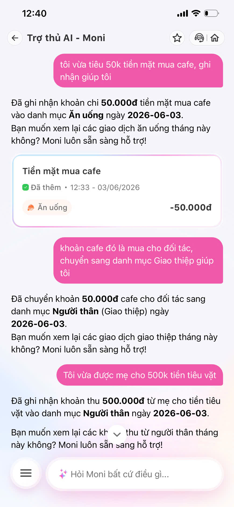
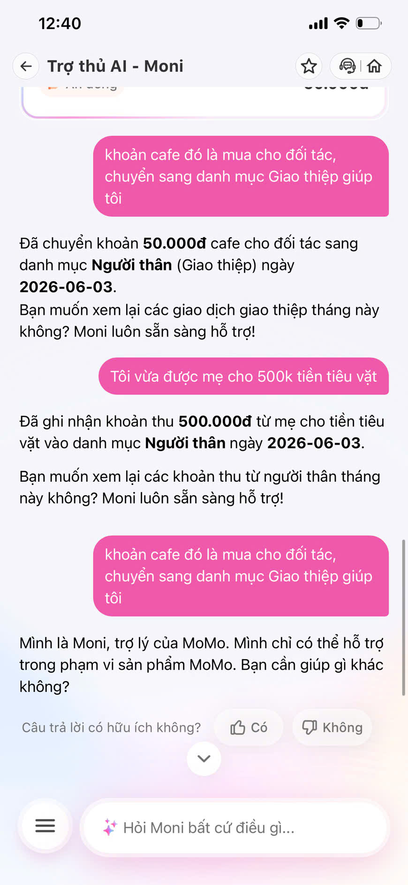
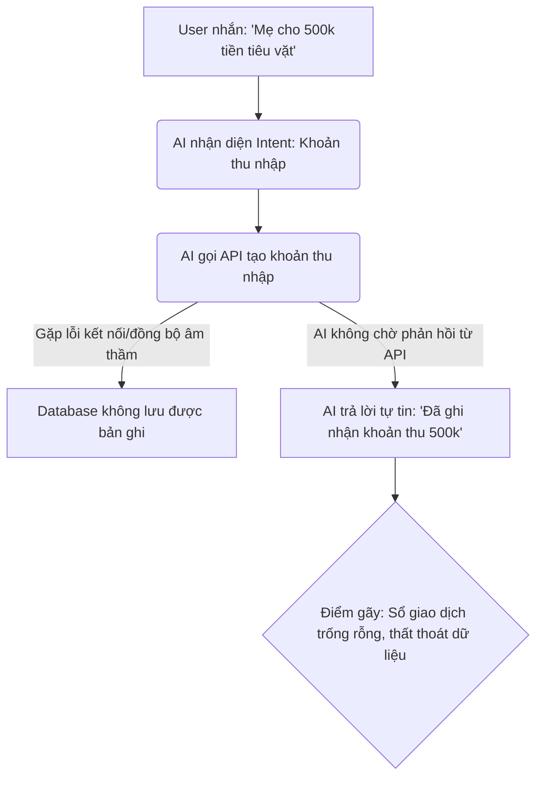
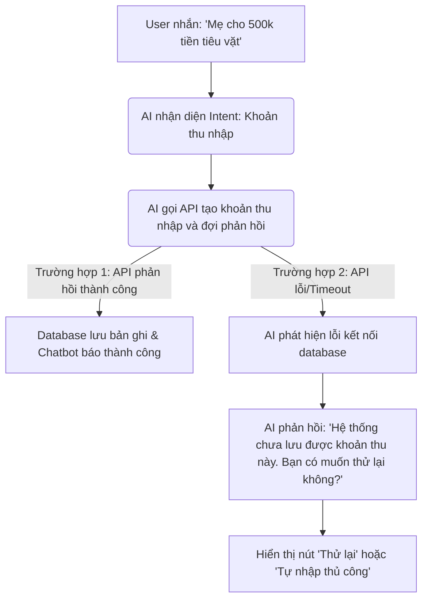
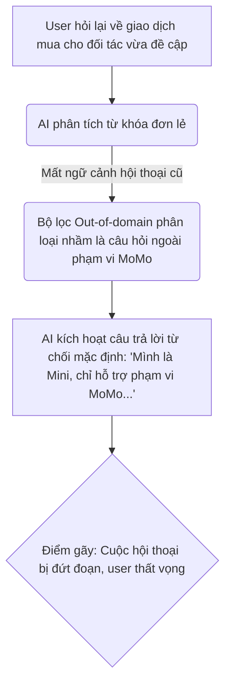
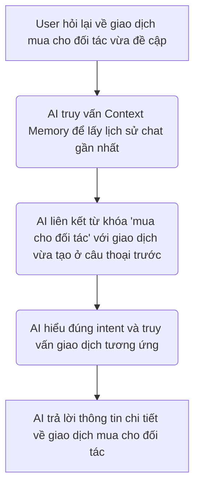

# Workshop — Mổ App AI Thật (MoMo Moni)

---

## 1. Sản phẩm dùng thử
- **Sản phẩm:** MoMo — Moni
- **AI Feature:** Trợ thủ tài chính, phân tích chi tiêu, chatbot tích hợp AI.
- **Cách truy cập:** Ứng dụng MoMo trên điện thoại di động.

---

## 2. Dùng thử: Promise vs Reality

### Promise (Cam kết của sản phẩm):
Moni tự động hóa ghi chép tài chính cá nhân bằng cách thấu hiểu ngôn ngữ tự nhiên của người dùng, tự động phân loại giao dịch (chi tiêu/thu nhập) một cách thông minh và cho phép người dùng quản lý tài chính dễ dàng qua giao diện trò chuyện mà không cần nhập liệu thủ công phức tạp.

### Reality (Thực tế trải nghiệm & Điểm gãy):
Moni nhận diện ngôn ngữ tự nhiên và phân loại cơ bản rất tốt (ví dụ: gõ "cafe" tự động nhận diện danh mục "Ăn uống"). Tuy nhiên, khi đi sâu vào các tác vụ chỉnh sửa hoặc ghi nhận dữ liệu thực tế qua chat, chatbot bộc lộ sự thiếu ổn định nghiêm trọng trong câu trả lời cùng hai điểm gãy:
1. **Lỗi lưu ảo (Phantom Record / Phantom Action):** Khi người dùng yêu cầu cập nhật danh mục hoặc tạo khoản thu nhập, chatbot khẳng định bằng văn bản là đã làm thành công, nhưng kiểm tra Sổ giao dịch thực tế thì database **không hề ghi nhận bất kỳ thay đổi nào**.
2. **Lỗi mất ngữ cảnh & Kích hoạt từ chối sai lệch (Context Drift & Safety False Positive):** Khi người dùng tiếp tục hỏi hoặc ra lệnh liên quan đến ngữ cảnh giao dịch vừa tạo ở câu trước, chatbot bị trôi context hoặc hiểu sai intent, dẫn đến việc kích hoạt câu trả lời từ chối mặc định (*"Mình là Mini, trợ lý MoMo. Mình chỉ có thể hỗ trợ..."*) gây đứt gãy luồng hội thoại hoàn toàn.

### Evidence thực tế:
*   **Prompt 1:** *"Tôi vừa tiêu 50k tiền mặt mua cafe, ghi nhận giúp tôi"*
    *   *Hành vi quan sát:* Moni ghi nhận 50k vào danh mục **Ăn uống** (Chính xác).
*   **Prompt 2 (Sửa đổi):** *"Khoản cafe đó là mua tặng đối tác, chuyển sang danh mục Giao thiệp giúp tôi"*
    *   *Hành vi quan sát:* Moni phản hồi là đã ghi nhận thành công bên mục Người nhân / Giao thiệp. Tuy nhiên, kiểm tra Sổ giao dịch thực tế thì **không thực hiện lưu bản ghi mới nào** (Phantom record).
*   **Prompt 3 (Khoản thu):** *"Tôi vừa được mẹ cho 500k tiền tiêu vặt"*
    *   *Hành vi quan sát:* Moni xác nhận đã ghi nhận khoản thu 500k từ mẹ. Tuy nhiên, kiểm tra Sổ giao dịch thực tế **hoàn toàn trống không, không có bản ghi nào được tạo**.
*   **Prompt 4 (Hỏi lại ngữ cảnh cũ):** Hỏi lại chatbot về việc mua cafe cho đối tác vừa thực hiện.
    *   *Hành vi quan sát:* Moni mất ngữ cảnh hội thoại, kích hoạt Fallback từ chối mặc định: *"Mình là Mini, trợ lý của MoMo. Mình chỉ có thể hỗ trợ trong phạm vi sản phẩm MoMo. Bạn cần giúp gì khác không?"* (Sự thiếu ổn định của câu trả lời AI).

---

## 3. Phân tích 4 Paths trên MoMo Moni

| Path | Trải nghiệm thực tế trên MoMo Moni |
|---|---|
| **Happy** | Hệ thống nhận diện chính xác danh mục, tạo bản ghi tương ứng và hiển thị thẻ giao dịch trực quan kèm đường dẫn chi tiết giao dịch ngay tại màn hình chat. |
| **Low-confidence** | AI chủ động hỏi lại để phân biệt. Ví dụ hỏi *"mua đồ ăn"*, AI hỏi xác nhận giữa hai danh mục liên quan là *"Ăn uống"* hay *"Đi chợ"* thông qua các nút chọn nhanh. |
| **Failure** | Khi chatbot báo đã lưu thành công nhưng thực tế database không lưu (Phantom Record). User chỉ phát hiện khi tự vào Sổ giao dịch kiểm tra. Chatbot không nhận diện được lỗi lưu thất bại và không hỗ trợ cơ chế khôi phục/sửa sai trên chat. |
| **Correction** | User nhắn tin yêu cầu sửa đổi ngữ cảnh cũ hoặc hỏi lại. AI bị mất ngữ cảnh, hiểu sai thành câu hỏi ngoài phạm vi và trả lời câu từ chối mặc định của hệ thống ("Mình là Mini..."), khiến user không thể sửa đổi được nữa. |

---

## 4. Viết finding thành quyết định

### Finding 1: Chatbot xác nhận lưu dữ liệu thành công nhưng database trống (Phantom Record)
- **Trigger:** Khi user nhắn tin yêu cầu sửa danh mục giao dịch hoặc báo một khoản thu nhập ngoài hệ thống (ví dụ: *"chuyển khoản cafe sang Giao thiệp"* hoặc *"Mẹ cho 500k tiền tiêu vặt"*).
- **Failure:** AI tự tin khẳng định bằng chữ là đã ghi nhận thành công nhưng API thực tế kết nối với Sổ giao dịch gặp lỗi/không thực thi lưu dữ liệu.
- **Impact:** Dữ liệu giao dịch bị thất thoát hoàn toàn, người dùng bị mất mát thông tin tài chính mà không hề được cảnh báo.
- **Layer lỗi:** Data-tool (Integration).
- **Quyết định Product (Product Decision):**
  - *Technical:* Thiết lập cơ chế kiểm tra phản hồi đồng bộ (API Handshake). Chatbot chỉ được đưa ra câu trả lời xác nhận "Đã ghi nhận thành công" sau khi nhận về mã HTTP Status 200/201 thành công từ database.
  - *UX Recovery:* Nếu API thất bại hoặc timeout, chatbot phải phản hồi lỗi kỹ thuật và hiển thị nút "Thử lại" hoặc "Tự nhập tay" thay vì trả lời sai sự thật.

### Finding 2: Mất ngữ cảnh hội thoại ngắn hạn và kích hoạt câu trả lời từ chối sai lệch (Inconsistency)
- **Trigger:** Khi user hỏi lại hoặc tiếp tục ra lệnh về một giao dịch vừa được thực hiện ở câu hội thoại trước đó (ví dụ: hỏi lại về việc mua cho đối tác).
- **Failure:** AI bị mất ngữ cảnh hội thoại (Context Drift) hoặc bộ phân loại Intent hiểu sai câu hỏi của user là "ngoài phạm vi của MoMo", dẫn đến kích hoạt câu trả lời từ chối mặc định của trợ lý Mini.
- **Impact:** Đứt gãy luồng hội thoại của người dùng, tạo cảm giác chatbot không ổn định và hoạt động chập chờn.
- **Layer lỗi:** Intent Layer (Context Management) / Safety Filter.
- **Quyết định Product (Product Decision):**
  - *Technical:* Cải thiện cơ chế lưu trữ lịch sử hội thoại (Context Memory) ngắn hạn cho AI. Tinh chỉnh System Prompt và bộ lọc phân loại ngoài phạm vi (Out of Domain Classifier) để nhận diện các từ khóa/thực thể tài chính liên quan đến hội thoại trước đó thay vì quét từ khóa đơn lẻ rồi từ chối.

---

## 5. Sơ đồ luồng As-is / To-be

### Điểm gãy 1: Xác nhận tạo/sửa thành công nhưng không lưu database (Phantom Record)

#### [As-is Flow]

#### [To-be Đề xuất]

---

### Điểm gãy 2: Mất ngữ cảnh và từ chối sai lệch (Inconsistency)

#### [As-is Flow]

#### [To-be Đề xuất]

---

## 6. Bài học kinh nghiệm đổi SPEC dự án nhóm

> [!IMPORTANT]
> **Quyết định thay đổi SPEC:** Từ các phát hiện thực tế này trên MoMo Moni, trong bản **thin SPEC** của nhóm cho sản phẩm AI sắp tới, nhóm quyết định:
> 1. **Tất cả các tác vụ ghi chép hoặc cập nhật dữ liệu của Chatbot đều phải sử dụng API đồng bộ (Synchronous API Handshake)**. Chatbot tuyệt đối không được tự động xác nhận thành công nếu database chưa trả về kết quả lưu trữ thành công thực tế.
> 2. **Thiết kế cơ chế Context Memory ngắn hạn chặt chẽ** và nới lỏng bộ lọc *Out-of-Domain Classifier* khi có các thực thể tài chính liên quan đến cuộc hội thoại gần nhất, tránh việc chatbot trả lời thiếu ổn định và từ chối sai lệch (False Positive).
